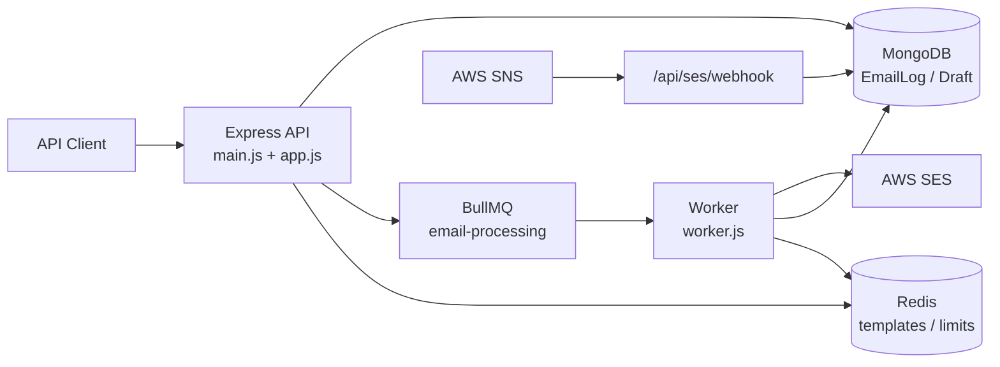

# Mass Mail Sender — Portfolio Engineering Case Study

**Project:** Email Microservice (`email-microservice`)  
**Repo:** [amazon-ses-node-server](https://github.com/rahulgnhub2025/amazon-ses-node-server)  
**Author signals:** ~47 commits; primary authorship `rahulkhedekarr`
**Codebase size (approx.):** ~17,000 lines under `src/` across 31 source files  
**Assessment date:** August 2026  

---

## Critical framing

This is a **production-oriented backend microservice**, not a React/Next.js SPA. There is **no browser UI** in-repo (`public/` is empty). For portfolio positioning as a Full Stack Engineer, treat this as deep **backend + API + data + DevOps + cloud integration** ownership, and pair it with a frontend case study (or a planned dashboard) if you want classic “UI + API” full-stack proof. Strengths here are **systems engineering**, not visual frontend craft.

**Security note:** Deployment docs may contain live-looking AWS credentials. Rotate those keys immediately and scrub docs before public portfolio use. Do not commit secrets.

---

## 1. Project Overview

| Field | Detail |
|--------|--------|
| **Project Name** | Mass Mail Sender / Email Microservice |
| **One-line summary** | Production Node.js microservice that queues, rate-limits, sends, tracks, and analyzes mass email campaigns via AWS SES, Redis/BullMQ, and MongoDB. |
| **Elevator pitch** | A Railway-deployable email engine that accepts JSON campaign payloads, fan-outs thousands of recipients through a durable queue, respects SES send limits, tracks delivery/bounce/complaint lifecycle, and exposes analytics/monitoring APIs for operational control. |
| **Problem it solves** | Sending newsletters/campaigns at scale without blocking HTTP requests, exceeding SES rate limits, losing delivery visibility, or creating duplicate sends when workers fail. |
| **Why it exists** | To provide a dedicated, horizontally separable email subsystem for an organization instead of embedding SES logic inside a monolith. |
| **Industry/domain** | MarTech / transactional & newsletter email infrastructure / B2B SaaS backend |
| **Target users** | Internal apps, admin tools, marketers/ops via API clients (Postman, automation, future dashboards)—not end consumers of email content |
| **Business value** | Reliable campaign delivery, deliverability compliance signals (bounces/complaints), ops visibility, lower AWS cost vs. naive retries, safer ops on constrained hosting (Railway Hobby) |
| **Key differentiators** | Claim-check template caching; anti-duplicate queue policy; pause-on-permanent-error; draft batching; dry-run stress testing; SNS webhook enrichment; extensive statistics/validation surface |

---

## 2. My Role

**Assumption:** Primary/sole engineer based on git authorship and end-to-end feature commits.

| Area | Ownership evidence |
|------|---------------------|
| **Responsibilities** | System design, API design, queue/worker design, SES integration, Mongo schema, Railway deploy, ops tooling, incident RCA docs |
| **Ownership** | End-to-end: entrypoint → routes → services → models → worker → deploy config |
| **Features built** | Newsletter send, draft campaigns, campaign APIs, monitoring abort/resume, SES webhooks, statistics/export/validation, dry-run testing, progress monitoring |
| **Major contributions** | BullMQ rate-limited pipeline; smart recovery/pause; graceful shutdown coordination; Redis claim-check; production logging; 10k simulation tooling |
| **E2E involvement** | Yes—API contract through async processing to persistence and webhook state updates |
| **Frontend ownership** | **None in-repo** (headless API). API ergonomics/docs act as the “client interface.” |
| **Backend ownership** | Full Express app, middleware, routes, services, worker |
| **Database design** | `EmailLog` (collection `feb`) + `DraftCampaign`; heavy indexing; campaign-as-aggregation pattern |
| **DevOps** | `railway.toml`, healthchecks, docker-compose for Redis/Mongo local, env validation, restart policy |
| **Deployment** | Railway Git deploy + managed Redis; Mongo Atlas-style URI expected |
| **UI/UX** | N/A for browser; UX is API UX (202 Accepted, correlation IDs, status polling) |
| **AI integration** | None |
| **Third-party integrations** | AWS SES, AWS SNS webhooks, Redis, MongoDB, Railway |

---

## 3. Tech Stack

| Category | Technology | Notes |
|----------|------------|-------|
| **Frontend** | None (headless) | External clients only |
| **Backend** | Node.js ≥18, Express 4, ESM | `type: "module"` |
| **Database** | MongoDB via Mongoose 8 | Collections: `feb`, `draft_campaigns` |
| **Authentication** | **Not implemented** | CORS allows `Authorization` header but no validation |
| **Storage** | MongoDB + Redis | Redis for queue + template cache + (intended) daily limit |
| **Hosting** | Railway | `railway.toml` healthcheck `/health` |
| **Cloud** | AWS (SES + SNS) | Primary email provider |
| **Styling** | N/A | |
| **State Management** | Campaign state in Mongo + pause markers; Redis job state | Not frontend state |
| **Animation** | N/A | |
| **Testing** | Manual/scripts (`DRY_RUN_MODE`, `/api/testing`, `simulate_10k.js`) | No Jest/Mocha suite in deps |
| **Monitoring** | Custom JSON dashboards, Winston logs, progress monitor | No Datadog/Sentry in deps |
| **Security** | Helmet, CORS, express-rate-limit, Joi, optional SNS verify | Gaps: API auth |
| **Payments** | None | |
| **Messaging** | BullMQ + Redis; AWS SNS inbound | |
| **Caching** | Redis templates; in-memory campaign/stats caches | |
| **Search** | Mongo text/index queries on errors/campaign filters | Not Elasticsearch |
| **AI APIs** | None | |
| **Developer Tools** | Winston, dotenv, ops scripts | |
| **Build Tools** | None required | `"build": "echo 'No build step required'"` |
| **Version Control** | Git/GitHub | Feature branches + PRs |
| **CI/CD** | Railway Git deploy | No GitHub Actions visible |
| **Package Managers** | npm | lockfile present |
| **Environment Management** | Env schema in `environment.js` | No `.env.example` |

---

## 4. Architecture

### Overall architecture



**Pattern:** API + async worker microservice with optional process modes (`--api-only`, `--worker-only`, both).

### Frontend architecture

N/A — JSON API only. Consumers poll status endpoints; rate limiting specially skips campaign status GETs to support polling.

### Backend architecture

Layered modular Node service:

- `main.js` — orchestration, env validation, shutdown
- `app.js` — Express middleware + mounts
- `routes/` — HTTP adapters + Joi
- `services/` — queue, SES, campaigns, stats, recovery
- `models/` — Mongoose schemas
- `worker.js` — BullMQ consumer
- `middleware/` — errors/timeouts
- `utils/` — logging, DB helpers, limits

### Folder structure (simplified)

```
src/
  main.js, app.js, worker.js
  config/     environment, database, logLevels
  middleware/ errorHandler
  models/     EmailLog, DraftCampaign
  routes/     newsletter, draft, campaigns, statistics, monitoring, webhook, testing
  services/   queue, sesClient, campaign*, statistics*, errorRecovery*, ...
  utils/      logger, temporaryLimit, database*
```

### Component / API architecture

- Service-oriented within a monolith process (or split API/worker)
- Campaign identity is a UUID shared across recipient logs—no separate live `Campaign` collection
- REST/JSON under `/api/*`, async send returns **202**, correlation IDs, consistent `{ success, data/error }` shapes

### Authentication & authorization

**Missing.** Public if network-reachable. SNS signature verification optional via `VERIFY_SNS_SIGNATURE`. No roles/scopes. Destructive ops (`abort`, `resume`, testing cleanup) are unauthenticated—roadmap item.

### Database relationships

Logical 1:N — one `campaignId` → many `EmailLog`; draft metadata in `DraftCampaign` linked by `campaignId`.

### Request lifecycle (newsletter)

1. Validate (Joi) → optional idempotency lookup  
2. Create `campaignId` → bulk insert `EmailLog(queued)`  
3. Cache HTML/text in Redis `campaign:{id}:template`  
4. Enqueue N lightweight jobs  
5. Return 202 + tracking URL  
6. Worker claim-checks template → SES → mark sent/failed  
7. SNS updates delivered/bounced/complained  

### Error handling, caching, performance

- Custom error classes, `asyncHandler`, central JSON handler, worker fail-closed pause checks, SES temporary vs permanent classification
- Redis template claim-check; statistics Redis/in-memory caches
- Rate limit ~10/s; concurrency 3–5; aggressive Bull retention for Railway memory; unordered `insertMany`

### Deployment & scalability

Railway service + Railway Redis + external Mongo; healthcheck path; restart on failure. Vertical/horizontal via separating API and worker processes; constrained by SES account limits and Mongo write/read patterns.

### Future improvements

API auth, separate Campaign collection, real retries with dedupe keys, Docker/K8s, observability stack, admin UI.

---

## 5. Database

### Collections

| Collection | Model | Purpose |
|------------|-------|---------|
| `feb` | `EmailLog` | Per-recipient lifecycle + analytics |
| `draft_campaigns` | `DraftCampaign` | Draft metadata + processed counts |

### Relationships

- `DraftCampaign.campaignId` ↔ `EmailLog.campaignId` (application-level)
- Pause control via special EmailLog row (`recipient: "CAMPAIGN_PAUSED_MARKER"`)

### Schema highlights

- Status machine: `queued | sent | delivered | failed | bounced | complained | paused | campaign_paused | draft`
- Bounce/complaint taxonomy fields
- Perf timings: `sesResponseTime`, `processingTime`, `queueWaitTime`
- RFC-aware subject max (998)
- Email/IP validators; sparse indexes on `messageId`, `idempotencyKey`
- Heavy compound indexes for analytics paths

### Normalization notes

- Templates not stored per recipient log for live sends (Redis claim-check)
- Subject duplicated per recipient log for query locality
- **Assumption:** collection name `feb` is operational partitioning rather than pure domain naming

### Validation & security

Joi at edge + Mongoose validators; unique recipients; HTML size caps (~1MB). PII in recipient emails; **no field-level encryption**; auth gap means DB exposure risk if API is public.

---

## 6. APIs

### Cross-cutting

| Concern | Behavior |
|---------|----------|
| Auth | None |
| Validation | Joi on most write/read params |
| Response | JSON + correlation IDs |
| Errors | Typed HTTP status via middleware |
| Rate limiting | Global ~100/15min on `/api/*`; campaign detail ~1000/15min; status polling often skipped |
| Pagination | Draft list, campaigns, recipients |
| Caching | Stats/campaign services; clients should poll |

### Endpoint map (condensed)

| Area | Endpoints | Purpose |
|------|-----------|---------|
| Health | `GET /health`, `/health/detailed` | Liveness/readiness |
| Newsletter | `POST /send`, `GET /campaign/:id/status`, `POST /send-test` | Blast + progress + dry-run |
| Draft | `POST /create`, `POST /send-batch/:id`, `GET /list` | Create + batch of 10 |
| Campaigns | `GET /`, `/:id`, `/:id/recipients`, `/dashboard/summary` | Ops listing |
| Monitoring | stats/health/worker/queue/dashboard; abort/resume; DLQ cleanup | Control plane |
| Webhook | `POST /api/ses/webhook/sns` | Bounce/complaint/delivery |
| Testing | quick/stress/cleanup/queue-info | Safe load simulation |
| Statistics | analytics, timeline, bounces, complaints, compliance, export, validate/reconcile, alerts, performance | Analytics plane |

---

## 7. Features

| Feature | Purpose | Implementation | Challenges | Why it matters |
|---------|---------|----------------|------------|----------------|
| Mass newsletter send | Blast up to ~10k–20k | Bulk insert + enqueue | Memory/Promise storms at enqueue | Core product value |
| Rate-limited sending | Stay under SES | BullMQ limiter ~10/s | Tuning concurrency vs throughput | Deliverability + account safety |
| Claim-check templates | Avoid huge jobs | Redis `campaign:{id}:template` | Resume must still find template | Redis/Railway memory hygiene |
| Anti-duplicate policy | Prevent multi-sends | `attempts:1`, `maxStalledCount:0` | Harder recovery | Learned from real incident |
| Campaign pause/resume | Ops control + fail-safe | Pause marker + status rewrite + `addBulk` | Fail-closed DB checks | Incident containment |
| Draft batch send | Controlled rollout | Batches of 10 drafts→queued | Manual pacing UX via API | Safer production sends |
| Dry-run mode | Test without SES cost | Mock MessageIds + delay | Global env mutation risk in testing routes | Load testing |
| Bounce/complaint webhooks | Compliance + list hygiene | SNS → status enrichment | Signature verify optional | Inbox reputation |
| Real-time progress | Ops visibility | Aggregations + polling APIs | Cache freshness | Campaign command center |
| Statistics/export/validation | Business reporting | Aggregation + reconcile services | Complexity/size | Trust in metrics |
| Graceful shutdown | No half-sent chaos | Coordinated pause/drain/close | Dual-handler race (fixed) | Cloud deploys (SIGTERM) |
| Env validation | Fail fast | `environment.js` schema | Secrets in docs risk | Ops reliability |

---

## 8. UI/UX

| Topic | Reality |
|-------|---------|
| Design system | None |
| Responsive / a11y / animations | N/A |
| Loading states | HTTP 202 + progress percentage fields |
| Error states | Structured JSON errors |
| User flows | API flows: create → poll → abort/resume |
| Navigation | N/A |
| Performance (UI) | Client-dependent |

**Portfolio angle:** Document “API UX” — predictable schemas, correlation IDs, polling-friendly rate limits, dry-run testing DX.

---

## 9. Engineering Challenges

### Challenge A — Duplicate mass sends (“2504 × 10 catastrophe”)

| | |
|--|--|
| **Problem** | ~2,504 recipients resent ~10× (~25k emails) |
| **Why hard** | Failures + retries + Redis persistence + wrong error classification compound |
| **Options** | Bull retries; SES-only retries; idempotent SES; no retries + pause |
| **Chosen** | Disable Bull auto-retry; classify permanent errors; pause campaign; SES internal retry with backoff |
| **Tradeoffs** | Safer against duplicates; weaker automatic recovery for transient infra failures |
| **Lesson** | In email systems, **exactly-once-ish delivery** beats naive reliability |

### Challenge B — Redis URL parsing on Railway

| | |
|--|--|
| **Problem** | ioredis URL parsing falling back to localhost |
| **Chosen** | Manual `URL` parse → host/port/password config; share connection with BullMQ |
| **Lesson** | Cloud PaaS quirks require defensive integration code |

### Challenge C — Graceful shutdown race

| | |
|--|--|
| **Problem** | Dual SIGINT handlers; `getActive` on closing worker |
| **Chosen** | Single coordinated shutdown in `main.js` with guarded drain |
| **Lesson** | Process lifecycle is part of product correctness |

### Challenge D — Huge HTML in every job

| | |
|--|--|
| **Problem** | 10k jobs × large HTML = Redis bloat |
| **Chosen** | Claim-check pattern |
| **Tradeoffs** | Extra Redis dependency for correctness of resume |

### Challenge E — Analytics correctness

| | |
|--|--|
| **Problem** | Counts drift under partial failures |
| **Chosen** | Validation/reconcile services + rich indexes |
| **Tradeoffs** | Large stats codebase; maintenance cost |

---

## 10. Performance Optimizations

| Technique | Present? | Detail |
|-----------|----------|--------|
| Lazy loading | N/A UI | Draft list excludes heavy templates |
| SSR/SSG/ISR | No | Not a Next app |
| CSR | No | |
| Memoization | Partial | In-memory service caches (TTL minutes) |
| Caching | Yes | Redis templates + stats cache |
| Image optimization | N/A | |
| Bundle optimization | N/A | No frontend bundle |
| DB optimization | Yes | Compound indexes, unordered bulk insert, projection on lists |
| API optimization | Yes | 202 async, polling exemptions, pagination |
| Network optimization | Yes | Jobs omit HTML body |
| Queue retention | Yes | Aggressive removeOnComplete/Fail for Hobby RAM |
| Concurrency tuning | Yes | `WORKER_CONCURRENCY` 3–5 for Railway |
| Dry-run simulation | Yes | Stress without SES |

**Claimed throughput (docs):** ~10 emails/sec → ~33 minutes for 20k (**assumption:** SES account limit aligned).

---

## 11. Security

| Control | Status |
|---------|--------|
| Authentication | ❌ Missing |
| Authorization | ❌ Missing |
| JWT/Cookies | ❌ Not used |
| Input validation | ✅ Joi + Mongoose |
| XSS | Limited relevance (JSON API); email HTML not sanitized (expected for email) |
| CSRF | N/A typical for tokenless JSON API |
| Rate limiting | ✅ HTTP + queue |
| Password hashing | N/A |
| Secrets/env | ✅ dotenv + validation; ⚠️ scrub secrets from docs |
| API security | Partial (Helmet/CORS/limits) |
| SNS verify | Optional, off by default |
| Debug endpoint | `/debug` exposes request meta — lock down in prod |

---

## 12. AI Usage

**Not applicable.** No LLM/embeddings/RAG/image generation. “Recommendations” in stats are rule/metric based (**assumption** from API naming).

---

## 13. Third-party Integrations

| Integration | Purpose | Implementation | Challenges | Limitations |
|-------------|---------|----------------|------------|-------------|
| AWS SES | Send mail | `@aws-sdk/client-ses` wrapper + retries | Throttling, error taxonomy | Account sandbox/limits, single region config |
| AWS SNS | Bounce/complaint/delivery | Webhook route | Signature verification optional | Must configure SES→SNS externally |
| Redis | Queue + cache | ioredis + BullMQ | PaaS URL parsing, memory | Single Redis dependency for correctness |
| MongoDB | Persistence/analytics | Mongoose | Index design, bulk partial fails | Collection naming ops-driven |
| Railway | Hosting | `railway.toml`, healthchecks | Hobby memory, SIGTERM | Less control than K8s |

---

## 14. DevOps

| Area | Practice |
|------|----------|
| Deployment | Git → Railway auto build/start |
| Hosting | Railway Node service |
| CI/CD | Platform deploy on push; no visible test gate |
| Monitoring | Custom `/health*`, `/api/monitoring/*`, Winston |
| Logging | Structured Winston; production single-line JSON |
| Backups | **Assumption:** Mongo Atlas / Railway Redis backups—not coded in app |
| Scaling | Split API/worker processes; scale workers horizontally against Redis |
| Env management | Validated env schema; docker-compose for local Redis/Mongo only |

---

## 15. Metrics

| Metric | Value | Confidence |
|--------|-------|------------|
| Users | Internal API consumers; **est. 1–10 services/operators** | Assumption |
| Requests/day | Highly variable; **est. tens–thousands** when campaigns run | Assumption |
| Campaign scale | Designed for 10k–20k recipients | Documented |
| DB size | **Unknown**; grows ~1 doc/recipient/campaign | Assumption |
| Send rate | ~10/sec | Documented + code default |
| API response (send) | Fast accept (202); work async | Design |
| Lighthouse / SEO / a11y | N/A (no UI) | Fact |
| Production incident volume | At least one major duplicate-send incident analyzed | Documented |
| Cost | Docs claim ~$2 / 20k emails SES | Assumption/pricing estimate |

---

## 16. Engineering Decisions

| Decision | Why | Tradeoff |
|----------|-----|----------|
| **Express (not Nest/Fastify)** | Fast path to production microservice | Less structure than Nest at scale |
| **Not React/Next.js** | Problem is async email infra, not SSR pages | Portfolio needs separate UI project for classic FS narrative |
| **MongoDB** | Flexible per-recipient event docs + aggregations | Weaker relational constraints; campaign entity implicit |
| **BullMQ + Redis** | Job queue with rate limiting | Extra infra; memory sensitivity on Hobby |
| **AWS SES** | Cost-effective bulk email at scale | Vendor lock-in; reputation management required |
| **attempts: 1** | Prevent duplicate disasters | Manual/ops resume paths needed |
| **Claim-check** | Memory/cost | Template TTL/resume coupling |
| **API + Worker colocation option** | Simple Railway deploy | Noisy-neighbor CPU; can split later |
| **Headless API** | Clear service boundary | No built-in admin UX |

---

## 17. Scalability

| Users / load | Feasible? | Changes needed |
|--------------|-----------|----------------|
| **100** | ✅ Easy | None |
| **1,000** | ✅ | Watch Mongo indexes |
| **10,000** | ✅ designed | Enqueue storm mitigation (`addBulk`), monitor Redis RAM |
| **100,000** | ⚠️ | Shard workers, SES limit increase, Campaign collection, chunked DB writes, stronger observability |
| **1M users** (product users) | ❌ as-is | Multi-tenant auth, isolation, dedicated infra, suppression lists, analytics warehouse, K8s, multi-region |

**Assumption:** “Users” above means campaign recipients / system load, not end-user accounts (there are no user accounts).

---

## 18. Code Quality

| Aspect | Assessment |
|--------|------------|
| Folder organization | Clear layered structure |
| Reusable modules | Service modules, shared error/logger utilities |
| Custom hooks | N/A (no React) |
| Utilities | Logger, DB retry/recovery, temporary limit |
| Constants/config | Env schema + log level toggles |
| Clean architecture | Good separation; some route files very large (`statistics.js`) |
| Naming | Generally descriptive; collection `feb` is opaque |
| Documentation | Extensive markdown RCA/guides (strong portfolio asset) |
| Dead/weak spots | Stub files; unused daily limit call; possible dashboard route-order issue |

---

## 19. SEO

**Not applicable** to a JSON API. No meta/OG/sitemap/robots. For a portfolio site hosting this case study, SEO belongs on the portfolio frontend, not this service.

---

## 20. Resume Highlights

### 10 resume bullets

1. Designed and shipped a production **Node.js email microservice** on **Railway** integrating **AWS SES**, **Redis/BullMQ**, and **MongoDB**.
2. Built an async campaign pipeline supporting **10k+ recipients** with **~10 emails/sec** SES-aware rate limiting.
3. Implemented **BullMQ workers** with concurrency controls tuned for constrained cloud memory profiles.
4. Applied a **claim-check pattern** to cache email templates in Redis and keep job payloads lightweight.
5. Engineered **anti-duplicate send guarantees** (`attempts:1`, stalled-job policy) after a real production multi-send incident.
6. Built **campaign pause/resume** with fail-closed controls on permanent SES/config failures.
7. Developed **draft campaign batching** (send-in-batches-of-10) for safer production rollouts.
8. Integrated **SES/SNS webhooks** for delivery, bounce, and complaint lifecycle tracking.
9. Delivered a large **analytics/monitoring API surface** (progress, bounces, export, reconciliation).
10. Implemented **graceful shutdown**, env validation, structured logging, and health endpoints for cloud deploys.

### 10 LinkedIn bullets

1. Sole-built a mass-email backend used for newsletter-scale campaigns.
2. Own the full path from HTTP API → queue → SES → Mongo analytics.
3. Obsessed over delivery correctness, not just “happy path” throughput.
4. Turned a production email incident into durable architectural safeguards.
5. Designed APIs for async work (202 + polling) instead of long-lived HTTP.
6. Optimized for real PaaS constraints (Railway Redis memory, SIGTERM).
7. Built dry-run/stress tooling to validate scale without burning SES quota.
8. Modeled rich email lifecycle states for ops and compliance visibility.
9. Wrote deep technical RCAs and production readiness docs.
10. Comfortable across Express, Mongo, Redis queues, and AWS messaging.

### 10 ATS-friendly achievements

1. Developed RESTful email campaign APIs using Express and Joi validation.
2. Implemented Redis-backed job queues with BullMQ rate limiting.
3. Integrated Amazon Simple Email Service (SES) using AWS SDK v3.
4. Designed MongoDB schemas and indexes for high-volume email logs.
5. Built webhook handlers for Amazon SNS bounce and complaint events.
6. Implemented structured logging with Winston and correlation IDs.
7. Deployed Node.js microservices to Railway with health checks.
8. Created monitoring endpoints for queue depth, worker health, and campaign status.
9. Implemented idempotency keys for safe campaign creation retries.
10. Developed operational scripts for queue recovery and campaign diagnostics.

---

## 21. Portfolio Highlights

**Project description:** Production email microservice that reliably sends and tracks mass campaigns through a rate-limited queue architecture.

**Technical summary:** Express + BullMQ + MongoDB + AWS SES/SNS; claim-check caching; pause/resume; analytics APIs; Railway deployment.

**Business summary:** Enables high-volume outreach with controllable cost, deliverability feedback, and operational kill-switches.

**Architecture summary:** Separable API/worker processes sharing Redis queue and Mongo persistence; event enrichment via SNS.

**Feature summary:** Newsletter blast, draft batches, monitoring control plane, statistics/export, dry-run stress tests.

**Challenges:** Duplicate prevention, PaaS Redis quirks, shutdown races, analytics correctness under partial failure.

**Results (documented + assumed):**

- Designed for 20k recipient campaigns at ~10/s
- Contained post-incident architecture to prevent repeat duplicate storms
- Production readiness self-assessed ~8.5/10 in internal report (**self-assessment**)

**Key achievements:** End-to-end ownership; real incident-driven design; cloud-native ops maturity unusual for many junior portfolios.

---

## 22. Interview Preparation

| # | Question | Ideal answer angle | Follow-up |
|---|----------|-------------------|-----------|
| 1 | Why a queue instead of sending in the request? | Decouple latency, enforce rate limits, survive crashes | What if Redis dies mid-campaign? |
| 2 | How do you prevent duplicate emails? | No Bull retries; SES categorization; pause on permanent; idempotency key | Safe retries with exactly-once? |
| 3 | Explain claim-check | Store template once in Redis; jobs carry IDs only | Template TTL vs resume |
| 4 | Why MongoDB for email logs? | Document-per-recipient fits lifecycle + aggregations | When move analytics to a warehouse? |
| 5 | How does pause/resume work? | Marker document + status rewrite + re-enqueue | Race between worker check and marker? |
| 6 | Temporary vs permanent SES errors? | Throttling/network retry; config/auth pause | How misclassification caused the incident? |
| 7 | How would you authenticate this API? | API keys/HMAC/JWT + least privilege on abort/resume | Complexity vs security |
| 8 | Scale to 100k recipients? | `addBulk`, more workers, SES limits, chunked DB writes | — |
| 9 | Why attempts=1 if reliability matters? | Email duplicates are worse than delayed sends | — |
| 10 | Graceful shutdown on Railway? | SIGTERM → pause worker → drain → close Redis/DB | — |
| 11 | How do bounces affect business? | Reputation, list hygiene, compliance | — |
| 12 | Draft batching vs full enqueue? | Human-in-the-loop risk control | — |
| 13 | Where are bottlenecks? | SES rate, Redis memory, Mongo bulk writes, enqueue storms | — |
| 14 | How do you test without real mail? | `DRY_RUN_MODE`, testing routes, simulate_10k | — |
| 15 | Consistency of statistics? | Validation/reconcile; eventual consistency with webhooks | — |
| 16 | Multi-tenant redesign? | tenantId, authz, per-tenant queues/limits | — |
| 17 | Why not Kafka? | BullMQ sufficient for SES-bound throughput; simpler on Railway | — |
| 18 | Idempotency design? | Client key maps to existing campaignId | Recipient-level idempotency? |
| 19 | Observability gaps? | OpenTelemetry, error tracking, queue lag SLOs | — |
| 20 | Biggest production lesson? | Error taxonomy + retry policy is a product decision | — |

---

## 23. Skills Demonstrated

| Category | Evidence |
|----------|----------|
| **Frontend** | Weak/none in-repo; strong API contract thinking |
| **Backend** | Express, middleware, workers, SES client |
| **Database** | Mongoose schema design, indexes, aggregations |
| **Cloud** | AWS SES/SNS, Railway |
| **Architecture** | Async microservice, claim-check, control plane |
| **DevOps** | Deploy config, healthchecks, graceful shutdown |
| **Security** | Hardening middleware; honesty about auth gap |
| **Performance** | Rate limits, concurrency, payload minimization |
| **Leadership** | RCA docs, production readiness assessments |
| **Product thinking** | Draft batches, abort/resume, dry-run, analytics for ops |
| **Problem solving** | Incident-driven redesign |
| **Communication** | Extensive technical documentation |

---

## 24. Hidden Skills

- Exactly-once / at-least-once tradeoff reasoning for side-effectful jobs
- PaaS constraint engineering (Hobby Redis memory, SIGTERM)
- Fail-closed control planes (pause marker)
- Operational tooling (recover/clear/force-complete scripts)
- Webhook-driven state machines
- Backpressure via queue rate limiters
- Correlation-ID oriented debugging
- Incident RCA writing
- API product design for async workflows
- Cost/risk controls (daily limit concept, dry-run)

---

## 25. Portfolio Assets to Create

1. System architecture diagram (API/Worker/Redis/Mongo/SES/SNS)
2. Email lifecycle state diagram
3. Sequence: newsletter send → queue → SES → SNS
4. Sequence: permanent error → pause → resume
5. Claim-check data flow diagram
6. ER-style diagram for EmailLog/DraftCampaign
7. Deployment diagram (Railway + Atlas + AWS)
8. Before/after diagram of duplicate-send incident
9. Throughput calculator visual (recipients ÷ 10/s)
10. Screenshot set: Postman 202 response, health/detailed, monitoring JSON, Railway metrics

---

## 26. STAR Stories

### STAR 1 — Stopping duplicate mass sends

- **S:** Campaign of ~2.5k failed and was later reprocessed; ~10× delivery (~25k emails).
- **T:** Stop recurrence; preserve ability to send at scale.
- **A:** RCA on error miscategorization + Redis retries; disable Bull auto-retry; improve classification; pause-on-permanent; document safeguards.
- **R:** Architecture biased to non-duplication; ops pause/resume path; portfolio-grade incident narrative.

### STAR 2 — Railway Redis connection failures

- **S:** Worker/queue pointed at localhost in cloud.
- **T:** Stable Redis connectivity.
- **A:** Manual URL parsing; shared connection; required `REDIS_URL`.
- **R:** Reliable queue in PaaS environment.

### STAR 3 — Graceful shutdown race

- **S:** SIGINT caused `getActive` TypeError; risky deploys.
- **T:** Safe drain on deploy/restart.
- **A:** Removed dual handlers; coordinated shutdown with error-tolerant drain.
- **R:** Predictable process lifecycle for Railway SIGTERM.

### STAR 4 — Redis memory / large templates

- **S:** Large HTML × many jobs threatened Redis.
- **T:** Support big campaigns on Hobby constraints.
- **A:** Claim-check + aggressive job retention.
- **R:** Scalable enqueue without Redis bloat.

### STAR 5 — Controlled draft sending

- **S:** Full blasts too risky for some ops flows.
- **T:** Safer progressive send.
- **A:** Draft create + `/send-batch` of 10.
- **R:** Human-paced production rollout mechanism.

---

## 27. Business Impact

| Impact | Estimate | Label |
|--------|----------|-------|
| Time saved vs manual/SMTP scripts | Hours per campaign + ops visibility | Assumption |
| Automation | Fully automated queue processing after API call | Fact |
| Revenue impact | Indirect (enables campaigns); not a billing product | Assumption |
| UX improvement | Faster API accept; progress tracking for operators | Fact/Assumption |
| Operational improvement | Abort/resume, dry-run, health, bounce insight | Fact |
| Cost control | SES pricing efficiency; avoided retry storms reduce waste | Fact/Assumption |
| Risk reduction | Duplicate-send architecture changes prevent reputation damage | Fact |

---

## 28. Future Roadmap

| Initiative | Why |
|------------|-----|
| API keys / JWT + RBAC | Close critical security gap |
| Docker + Compose app service | Reproducible deploys |
| Kubernetes HPA on workers | Elastic send capacity |
| Redis Cluster / managed multi-AZ | Queue HA |
| Outbox/event-driven campaign events | Cleaner integrations |
| Elasticsearch/ClickHouse | Fast analytics at 100k+ |
| GraphQL gateway (optional) | Flexible dashboard queries |
| Suppression list service | Deliverability |
| Frontend admin dashboard | Completes full-stack story |
| OpenTelemetry + Sentry | Production observability |
| True idempotent retries | Best of recovery + safety |
| Wire daily email limit into worker | Finish safety feature |
| Fix campaign dashboard route ordering | Product correctness |
| Microservices split (ingest / sender / analytics) | Team-scale evolution |

---

## 29. Recruiter Summary

This project is strong evidence of a **backend-leaning Full Stack / Platform engineer** who can own a revenue-adjacent infrastructure service end to end: API design, asynchronous processing, cloud email delivery, data modeling, operational control planes, and production incident response. Unlike tutorial CRUD apps, it demonstrates real distributed-systems tradeoffs—especially **duplicate prevention**, **rate limiting against third-party quotas**, and **PaaS-aware reliability**. Pair it with a dashboard UI or another frontend project to round out classic full-stack visuals; on its own, it already proves senior-leaning judgment in systems design and production hardening.

---

## 30. Portfolio Content (ready to paste)

### Hero section

**Mass Mail Sender**  
*Production email microservice for reliable, rate-limited campaign delivery at scale.*  
Built with Node.js, Express, BullMQ, MongoDB, and AWS SES—designed for real cloud constraints, not demos.

### Short project card

Headless email engine that queues and sends thousands of messages via AWS SES with Redis-backed workers, campaign pause/resume, bounce tracking, and analytics APIs. Deployed on Railway.

### Detailed case study (short form)

I designed a microservice that accepts campaign payloads, persists per-recipient state, and processes sends through a rate-limited BullMQ worker aligned to SES limits. After a production duplicate-send incident, I redesigned retry policy and failure classification to prioritize delivery safety. Templates use a claim-check pattern to protect Redis memory. Ops can abort/resume campaigns and inspect progress, bounces, and performance through JSON APIs. The system runs on Railway with MongoDB and Redis, with graceful shutdown and health checks for safe deploys.

### Feature list

- Async mass send (202 Accepted)
- Draft + batch send
- Queue rate limiting
- Pause/resume control plane
- SES + SNS lifecycle tracking
- Analytics / export / validation APIs
- Dry-run stress testing
- Railway-ready deployment

### Tech stack chips

Node.js · Express · BullMQ · Redis · MongoDB · Mongoose · AWS SES · AWS SNS · Winston · Joi · Railway · Docker Compose (local infra)

### Challenges → Solutions

| Challenge | Solution |
|-----------|----------|
| Duplicate sends from retries | Disabled auto-retry; pause on permanent errors |
| Huge job payloads | Redis claim-check templates |
| Cloud Redis misconfig | Manual URL parsing |
| Unsafe shutdown | Coordinated graceful drain |
| Blind operations | Monitoring + statistics APIs |

### Engineering highlights

- ~17k LOC service layer ownership
- Incident-driven architecture
- Separable API/worker modes
- Fail-closed campaign controls

### Architecture overview

API writes logs + enqueues jobs → Worker sends via SES using cached templates → SNS webhooks update delivery outcomes → Analytics APIs aggregate campaign health.

### Screenshots to include

1. Postman `POST /api/newsletter/send` → 202
2. Campaign status progress JSON
3. `/health/detailed` all green
4. Monitoring abort/resume responses
5. Railway deployment + Redis service
6. (Optional) Log snippet of rate-limited throughput

### Metrics to showcase

- Up to 10k–20k recipients/campaign
- ~10 emails/sec controlled throughput
- Sub-second API accept for large campaigns (async)
- Documented production incident → permanent safeguards

### Timeline (**assumption** from git)

- Early 2026: core queue/SES/newsletter
- Feb 2026: draft campaigns, recovery, dry-run, logging
- Feb–Mar 2026: campaign APIs, entrypoint hardening, DB speed probes

### Lessons learned

1. Retries are dangerous when the side effect is email.
2. Error classification is a product feature.
3. PaaS limitations shape architecture as much as scale goals.
4. Ops APIs (abort/status) are as important as send APIs.
5. Documentation of failures is a career asset.

### Future improvements

AuthN/Z, admin UI, stronger observability, safer automated retries, analytics warehouse, container orchestration.

---

## Positioning Advice

| Do | Don’t |
|----|-------|
| Lead with **distributed systems + API product** | Claim a React/Next UI that isn’t in the repo |
| Show diagrams + incident STAR story | Hide the auth gap—own it as roadmap |
| Pair with a dashboard frontend project | Paste AWS keys into portfolio materials |
| Quantify 10/s, 10k recipients, 202 async | Oversell “auto-scaling” without HPA evidence |

---

## Related project docs

- [README.md](./README.md) — Railway deployment guide
- [API_DOCUMENTATION.md](./API_DOCUMENTATION.md) — API reference
- [PRODUCTION_READINESS_REPORT.md](./PRODUCTION_READINESS_REPORT.md) — Production assessment
- [EMAIL_DISASTER_ANALYSIS_REPORT.md](./EMAIL_DISASTER_ANALYSIS_REPORT.md) — Duplicate-send RCA
- [GRACEFUL_SHUTDOWN_BUG_ANALYSIS.md](./GRACEFUL_SHUTDOWN_BUG_ANALYSIS.md) — Shutdown race RCA
